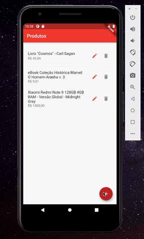

# Atividade AI2 - parte 1  
  
App em Flutter para entrega da "Atividade AI2 - parte 1" do curso "Tópicos avançados em programação", Faculdade Einstein Limeira.  
  
### Requisitos  
Desenvolver um app em Flutter com:  
  
- Uso de SQLite;  
- Tela de entrada com listagem de itens, botão para adicionar;  
- Ao clicar no botão para adicionar, ir para nova tela com dados para inserir novo item, ao inserir voltar a tela de listagem, ao cancelar também voltar só que sem a inclusão;  
- Na tela de entrada ao clicar sobre um item ir para a tela de visualização / edição;  
- Na tela de visualização, os dados do item irão aparecer e poderão ser modificados, um botão ALTERAR realiza a alteração e volta para a tela de listagem, o botão EXCLUIR apresenta mensagem de confirmação e exclui um item, voltando a tela de listagem. A opção CANCELAR nada faz e volta a tela de listagem;

### Demo

